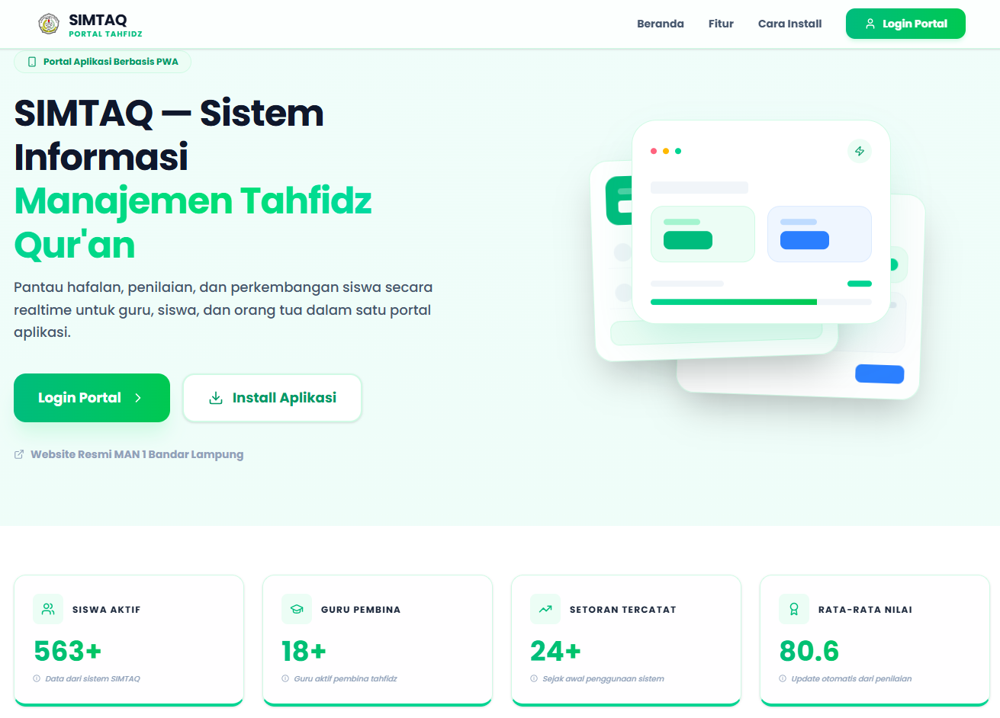
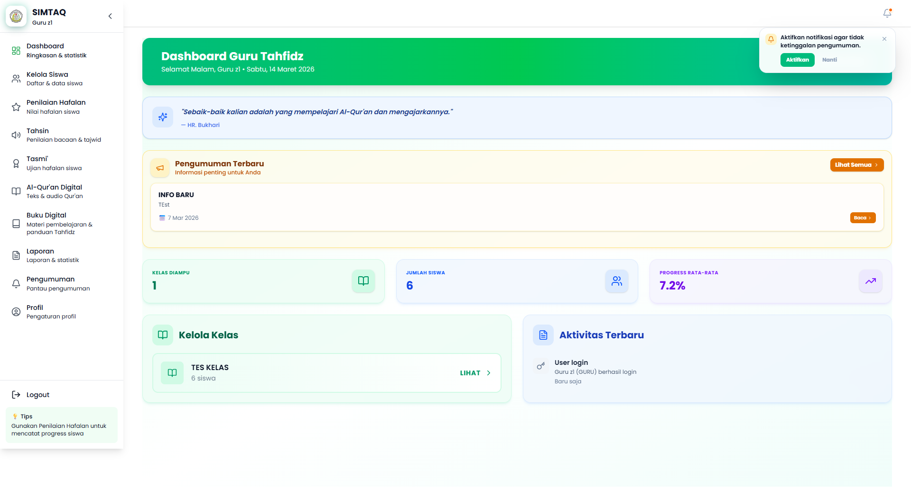

# SIMTAQ — Sistem Informasi Manajemen Tahfidz Al-Qur'an

## Deskripsi Proyek
SIMTAQ adalah platform internal MAN 1 Bandar Lampung untuk memusatkan monitoring hafalan Al-Qur'an. Aplikasi ini merangkum aktivitas Guru Pembina, Siswa, dan Orang Tua dalam satu portal berbasis web progresif sehingga setiap pihak bisa melihat progres tahfidz, nilai, hingga catatan pembinaan secara realtime.

### Fitur Utama
- Monitoring hafalan mendetail per juz, surah, dan ayat lengkap dengan catatan setoran.
- Antarmuka multi-role yang berbeda untuk admin, guru, siswa, dan orang tua.
- Distribusi pengumuman, jadwal, serta notifikasi push langsung ke perangkat pengguna.
- Rekap otomatis berupa PDF, sertifikat, serta ekspor XLSX untuk kebutuhan administrasi.
- Dukungan instalasi PWA agar aplikasi dapat dipasang seperti native app.

## Screenshot





## Teknologi yang Digunakan
- Next.js 14 (App Router) + React 18 untuk antarmuka dan server components.
- Tailwind CSS 4, Radix UI, dan Headless UI untuk sistem desain yang konsisten.
- Prisma ORM dengan PostgreSQL (`pg`) untuk akses data yang aman dan terukur.
- Auth.js / NextAuth.js 5 memakai `@auth/prisma-adapter` untuk autentikasi multi-role.
- TanStack React Query & SWR untuk strategi fetching/refresh data realtime.
- Web Push (service worker `public/sw.js`, `web-push`) untuk notifikasi perangkat.
- jsPDF, pdf-lib, dan xlsx untuk pembuatan laporan, sertifikat, serta ekspor dokumen.
- Sharp dan @vercel/blob untuk optimasi berkas, tanda tangan digital, dan upload lampiran.

## Cara Menjalankan Project
1. **Persyaratan awal**
	- Node.js >= 20 dan npm (atau pnpm/bun bila diinginkan).
	- PostgreSQL yang bisa diakses oleh aplikasi.
	- OpenSSL untuk menghasilkan secret / key VAPID.
2. **Install dependensi**
	```bash
	npm install
	```
3. **Siapkan environment variables**
	- Buat file `.env.local` lalu isi minimal `DATABASE_URL`, `NEXTAUTH_SECRET`, `NEXTAUTH_URL`, `NEXT_PUBLIC_APP_URL`, `VAPID_PUBLIC_KEY`, `VAPID_PRIVATE_KEY`, dan konfigurasi lain yang dirujuk di `auth.config.js`, `prisma/schema.prisma`, serta `public/sw.js`.
	- Jalankan `npx auth secret` bila perlu menghasilkan nilai secret baru.
4. **Migrasi & seeding database**
	```bash
	npx prisma migrate deploy
	npm run db:seed
	# atau: npm run db:reset (reset + seed ulang)
	```
5. **Menjalankan server pengembangan**
	```bash
	npm run dev
	```
	Aplikasi dapat diakses di http://localhost:3000.
6. **Build untuk produksi**
	```bash
	npm run build
	npm run start
	```
7. **Quality check opsional**
	```bash
	npm run lint
	```
